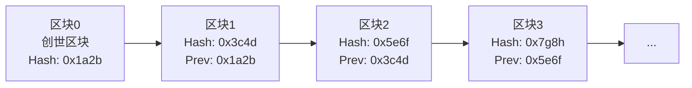
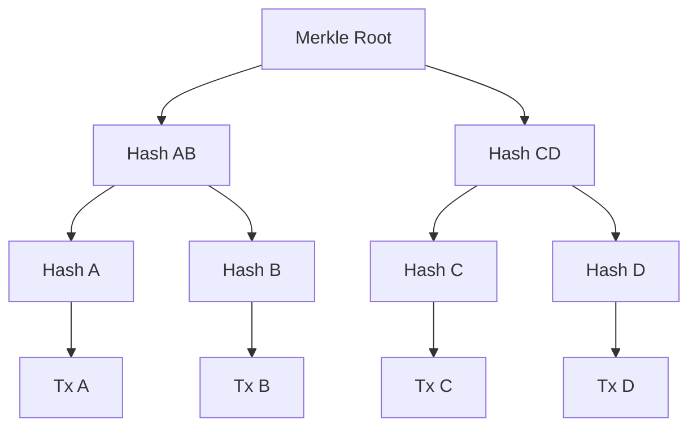
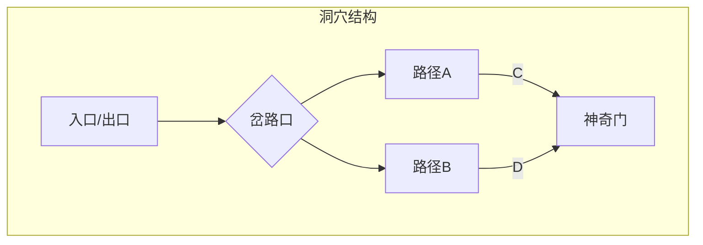
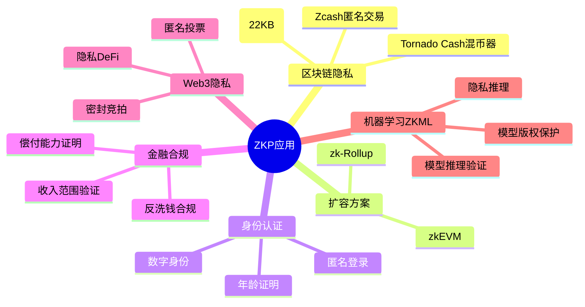
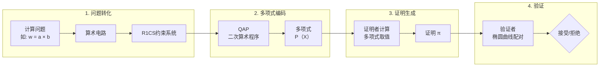
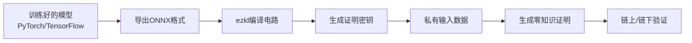
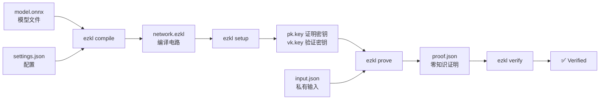

# 区块链技术原理与应用

从零到一理解去中心化信任机器

原理 | 技术 | 应用

---

## 概览

<br/>

### Part 1 - 区块链起源、核心概念、工作原理、共识机制初探
### Part 2 - 密码学基础、智能合约、公链与联盟链、扩容方案、零知识证明(ezkl)
### Part 3 - DeFi/NFT/DAO、产业应用、监管趋势、未来展望

<br/>
<br/>

区块链被誉为继大型机、 个人电脑、 互联网、 移动/社交网络之后计算范式的第五次颠覆式创新, 是人类信用进化史上继血亲信用、 贵金属信用、 央行纸币信用之后的第四个里程碑。


---

# Part 1：基础原理

## 传统中心化系统的信任困境

- 我们依赖**银行、政府、大公司**作为信任中介
- 问题：单点故障、数据篡改风险、高昂中介费、隐私泄露
- 案例：2008年金融危机，银行系统引发全球信任崩塌

> "我们需要一个基于密码学而非信任的电子支付系统" —— 中本聪

## 比特币白皮书：一场思想实验

- 目标：去除第三方中介，实现直接转账
- 核心创新：结合密码学、P2P网络、工作量证明
- **2008年10月31日**，中本聪发布《比特币：一种点对点的电子现金系统》
- 一周后, 中本聪发送了10个比特币给密码学专家哈尔芬尼, 形成了比特币史上第一次交易
- **2010年5月**, 佛罗里达程序员用1万比特币购买价值为25美元的披萨优惠券, 从而诞生了比特币的第一个公允汇率.
- **2013年11月**创下每枚比特币兑换1 242美元的历史高值, 超过同期每盎司1 241.98美元的黄金价格

---


---

# 区块链的定义


- 从比特币的诞生到分布式账本
- 区块链是一种**去中心化、不可篡改、全程留痕、可以追溯**的分布式账本技术。

- **去中心化**：没有单一控制节点
- **不可篡改**：数据一旦上链，几乎无法更改
- **透明可溯**：所有交易历史公开可查

## 区块 + 链 = 区块链

1. **区块 (Block)**：记录一段时间内的交易数据
2. **链 (Chain)**：通过密码学哈希将区块串联
3. 每个区块包含：**Magic Number**、**区块大小**、**区块头**、**交易计数**、**交易详情**

---

- 区块链系统一般具备如下五个关键要素, 即公共的区块链账本、 分布式的点对点网络系统、 去中心化的共识算法、 适度的经济激励机制以及可编程的脚本代码。

- 狭义来讲, 区块链是一种按照时间顺序将数据区块以链条的方式组合成特定数据结构, 并以密码学方式保证的不可篡改和不可伪造的去中心化共享总账(Decentralized shared ledger), 能够安全存储简单的、 有先后关系的、 能在系统内验证的数据. 广义的区块链技术则是利用加密链式区块结构来验证与存储数据、 利用分布式节点共识算法来生成和更新数据、 利用自动化脚本代码(智能合约)来编程和操作数据的一种全新的去中心化基础架构与分布式计算范式

- 区块链技术是具有普适性的底层技术框架, 可以为金融、 经济、 科技甚至政治等各领域带来深刻变革. 按照目前区块链技术的发展脉络, 区块链技术将会经历以可编程数字加密货币体系为主要特征的区块链1.0模式、 以可编程金融系统为主要特征的区块链2.0模式和以可编程社会为主要特征的区块链3.0模式

- 目前, 一般认为区块链技术正处于2.0 模式的初期, 股权众筹和P2P借贷等各类基于区块链技术的互联网金融应用相继涌现. 然而, 上述模式实际上是平行而非演进式发展的, 区块链1.0模式的数字加密货币体系仍然远未成熟, 距离其全球货币一体化的愿景实际上更远、 更困难. 目前, 区块链领域已经呈现出明显的技术和产业创新驱动的发展态势

---
layout: two-cols-header
---

# 区块结构详解

::left::

| 字段 | 大小 | 描述 |
|------|------|------|
| Magic Number | 4字节 | 标识网络（0xD9B4BEF9 = 比特币主网） |
| Blocksize | 4字节 | 区块字节数 |
| Blockheader | 80字节 | 包含6个关键字段 |
| Transaction Counter | 1-9字节 | 交易数量 |
| Transactions | 可变 | 所有交易数据 |

::right::

## 区块头block header的六要素

1. **版本号**：软件版本
2. **前一个区块哈希**：链接到父区块（形成链条）
3. **Merkle根**：所有交易的哈希树根
4. **时间戳**：区块产生时间
5. **难度目标**：工作量证明的难度值
6. **Nonce**：随机数，矿工不断尝试的值

<style>
.two-cols-header {
  column-gap: 20px;
}
</style>

---

# 哈希函数：区块链的指纹

- 输入任意长度数据，输出固定长度字符串
- 特性：
  - **确定性**：相同输入永远得到相同输出
  - **单向性**：无法从哈希反向推导输入
  - **雪崩效应**：输入微小改变，输出巨大变化
  - **抗碰撞**：极难找到两个不同输入产生相同哈希

---

# 链式结构：为什么叫"链"



- 比特币区块链的第一个区块(称为创世区块,genesis block)诞生于2009年1月4日, 由创始人中本聪持有
- 修改任何一个区块，其后的所有区块哈希都需重新计算
- 计算成本随链条长度指数增长 → 不可篡改

---


# Merkle树：高效验证交易



- Merkle Tree 本质是一个分层聚合哈希的数据结构, e.g., Hash AB = hash(Hash A + Hash B)
- 轻节点无需下载整个区块，只需Merkle路径即可验证交易存在
- 对数级验证复杂度 O(log n)

---

# 节点类型与网络角色

| 节点类型 | 功能 | 特点 |
| --- | --- | --- |
| 全节点 | 验证并转发交易，存储完整账本 | 安全、占用空间大 |
| 轻节点 | 仅同步区块头 | 适合手机钱包 |
| 矿工节点 | 参与共识，打包区块 | 需要算力 |
| 归档节点 | 存储所有历史状态 | 用于查询分析 |

---


---


# 以太坊

- 以太坊(Ethereum)平台即提供了图灵完备的脚本语言以供用户来构建任何可以精确定义的智能合约或交易类型。
- 一种新的法律形式：现行法律的本质是一种合约。它是由（生活于某一社群的）人和他们的领导者之间所缔结的，一种关于彼此该如何行动的共识。个体之间也存在着一些合约，这些合约可以理解为一种私法，相应的，这种私法仅对合约的参与者生效。例如，你和一个人订立合约，借给他一笔钱，但他最后毁约了，不打算还这笔钱。此时你多半会将对方告上法庭。在现实生活中，打官司这种事情常常混乱不堪并且充满了不确定性。将对方告上法庭，也通常意味着你需要支付高昂的费用聘请律师，来帮你在法庭上针对法律条文展开辩论，而且这一过程一般都旷日持久。而且，即使你最终赢了官司，你依然可能会遇到问题（比如，对方拒不执行法庭判决）。令人欣慰的是，当初你和借款人把条款写了下来，订立了合约。但法律的制定者和合约的起草者们都必须面对一个不容忽视的挑战：那就是，理想情况下，法律或者合约的内容应该是明确而没有歧义的，但现行的法律和合约都是由语句构成的，而语句，则是出了名的充满歧义。因此，一直以来，现行的法律体系都存在着两个巨大的问题：首先，合约或法律是由充满歧义的语句定义的，第二，强制执行合约或法律的代价非常大。

---

- 以太坊（Ethereum），通过数字货币和编程语言的结合，解决了现行法律体系的这两大问题。以太坊系统自身带有一种叫做以太币（Ether）的数字货币。以太币和著名的数字货币比特币（Bitcoin）有着非常多的相似之处。两者均为数字储值货币，且无法伪造，都以去中心化的方式运行来保证货币供应不被某一方所控制。两者都可以像电子邮件一样，作为货币自由地在全世界流通。
以太坊的另一半，由一个完整的编程语言构成，有时也被叫做以太脚本（EtherScript）。我们都知道，编程语言是人类用来控制计算机工作的，而反过来，计算机则无法猜透人类的意图，因此用任何编程语言写好的指令，对计算机来说都是准确无误没有歧义的。也就是说，计算机如何执行一段代码是没有二义性的。在同样的条件下，这段代码总是会按照既定的步骤执行。这种特性正是人类现行法律与合约中所缺失的。好消息是，有了以太脚本（EtherScript）之后，我们真的可以订立具备这种特性的合约了！
所以说，以太坊集数字货币（以太币，Ether）和编程语言（以太脚本，EtherScript）于一身，也正是这两者的结合，才让以太坊变得非常特别。

- 考虑到大部分的合约都涉及到经济价值的交换或者具有某种经济后果，因此我们可以在以太坊上用代码实现人类社会中各式各样的法律与合约。用代码实现合约，可以有严格明确的定义，并且可以自动被执行！

---
layout: two-cols-header
---

# 以太坊智能合约例子

::left::

你做了一个“任务管理”的网站，然后张三想以 5000 元的价格购买这家网站，同时张三承诺会在三月份进行付款。按照传统的交易流程，首先，你会与张三签订一个合约，合约里规定张三在三月份向你付款。合同签订完毕，你就将网站的控制权转移到了张三手里，等着张三到三月份给你付款。等到了三月份，按照你对合约的理解，张三应该付款了。但这时候，张三说，他认为合同里的三月份指的是明年三月，而不是今年三月。这个时候，你就要准备好花钱请律师去法庭上好好讨论一下合同里的“三月份”到底是何年何月了。

::right::


---

# 智能合约“依法治国”

- 初期，基于以太坊的智能合约，会首先在涉及虚拟货币、网站、软件、数字内容、云服务等数字资产的领域生根发芽，因为针对数字资产的“强制执行”非常直接有效。但是，随着时间的迁移，以太坊会逐步渗透到“现实世界”。比如，基于以太坊上的某种租赁协议的汽车可以通过某种数字证书进行发动（而不是传统的车钥匙）。而如果这个数字证书不符合该租赁协议（例如证书到期），汽车就不会发动。

- 在一个私法和公法可以被完美地监督和执行的未来世界里，很多事情都变得可能。你可以想象一下，一个当地法律均靠以太脚本订立的小镇。在这个小镇上，新法的通过和针对既有法律的修正案都必须通过投票系统进行公开投票决议，不出所料，这个投票系统也是由以太脚本实现的。同时，镇上的居民也会非常清晰地意识到法律的执行和适用范围。

- 甚至可以想象一个不靠地理边界而是基于智能合约的法规和权益的国家，未来的人们甚至可以自由选择最适合自己的虚拟国度。
从未来的角度看，今天现行的法律系统看起来是如此地茹毛饮血。未来人看来，当代的我们，拥有连篇累牍的，即使在法院看来也依然充满歧义的法律条文。同时，我们订立的合约充满了虚假的个人承诺和渺茫的兑付希望。
因此，随着以太坊的出现，人类历史上第一次，一种新的法律形式已然诞生。

---

# “乌托邦”和现实的妥协

- 区块链的上述技术特征实际上更适用于“乌托邦”式的社会形态和应用场景, 而这与现实社会的内在运行规律势必存在着根本性的矛盾和冲突, 因而极有可能限制区块链技术的应用场景和范围, 并在一定程度上阻碍区块链技术的发展

- 针对现实应用场景的、融合传统技术的区块链解决方案。
e.g. 与中心化集权体制的计算模式相比, 去中心化的区块链分权体制虽然有着更好的鲁棒性和安全性, 但不可避免地会导致其共识控制的效率低下, 因而这种“失控”状态的区块链系统目前尚难以全面应用于类似金融系统等关系国计民生的重要领域.为此, 多中心化甚至完全中心化的联盟链和私有链相继出现, 旨在通过削弱系统的去中心化程度来增强区块链“主权”的控制能力.目前, 这些形态的区块链技术正在快速发展, 并涌现出以超级账本(Hyperledger)等为代表的相对成熟的企业级应用解决方案.然而, 这类针对特定应用需求改造后的区块链技术是否还是真正的“区块链”目前仍然尚存争论

- 区块链系统强调全体节点的共识并以此维护历史数据的不可(或极难)篡改性, 这种基于集体智慧的民主共治思想和价值观通常会在节点决策失误或历史数据存在问题时陷入窘境. 2016年6月, 基于区块链技术的以太坊众筹项目The DAO由于其智能合约存在重大缺陷而遭受攻击, 以太坊社区在是否维护“区块链数据不可更改”这一本质特征的争论中未能达成共识, 通过硬分叉方式形成两条独立运行的区块链.这次分叉无疑是区块链理想向现实妥协的例证

- 区块链技术公开和透明的特点使其特别适合精准扶贫、慈善捐款等政务领域.然而, 对于强调隐私保护和通过构筑信息优势获利的商业领域来说, 区块链可能并非最佳解决方案

---

# 去中心化程度谱系

1.2 共识机制：如何达成一致

## 拜占庭将军问题

- 问题描述：多个将军围攻城池，如何在一部分叛徒存在下达成一致？
- 计算机科学意义：分布式系统中，如何在恶意节点存在下达成共识
- 区块链提供了一种实用解法：经济激励 + 密码学

---

# 主流共识机制

## PoW（工作量证明）- 比特币的基石

- 核心思想：消耗计算资源证明"诚意"
- 过程：寻找一个 Nonce，使区块头哈希值 < 目标难度值
- 难度调整：每 2016 个区块（约 2 周），根据全网算力调整
- 优点：极其安全，经过 10 年实践检验
- 缺点：能耗巨大，TPS 低（~7 笔/秒）

## PoS（权益证明）- 绿色替代方案

- 核心思想：根据持有的代币数量和时间（币龄）决定出块权
- 过程：质押代币 → 被选为验证者 → 出块获得奖励
- 代表项目：以太坊 2.0、Cardano、Solana
- 优点：能耗低，高 TPS（10 万+）
- 缺点：Nothing at Stake 问题，富者愈富

---

# 其他共识机制一览

| 机制 | 代表项目 | 特点 |
| --- | --- | --- |
| DPoS | EOS, TRON | 代币持有者投票选超级节点 |
| PoA | VeChain | 权威节点验证，高吞吐 |
| PBFT | Hyperledger Fabric | 联盟链常用，三阶段投票 |
| PoH | Solana | 历史证明，内置时间戳 |

---


# 分叉：当社区产生分歧

硬分叉 vs 软分叉

| 分叉类型 | 特点 | 案例 |
| --- | --- | --- |
| 硬分叉 | 新旧版本不兼容，产生两条独立链 | 以太坊 ETC/ETH |
| 软分叉 | 向后兼容，仍然同一条链 | SegWit 升级 |

---

# 以太坊硬分叉


<video controls="controls">
    <source src="/public/etherum_hard_fork.mp4" type="video/mp4">
</video>

---

# 零知识证明(ZKP)

隐私保护的密码学革命

## 要点

1. 什么是零知识证明？
2. 阿里巴巴洞穴的经典故事
3. ZKP的三大核心特性
4. 交互式vs非交互式ZKP
5. 主流ZKP技术对比 (zk-SNARK/zk-STARK/Bulletproofs)
6. ZKP六大应用场景
7. ZKP如何工作？(数学原理)
8. ezkl框架

---

# 零知识证明定义

> **零知识证明 (Zero-Knowledge Proof, ZKP)** 是一种密码学方法，允许**证明者**向**验证者**证明自己知道某个秘密，而**不泄露该秘密本身**。

**通俗理解**

- 你说你认识一个人，但不需要出示他的照片
- 你证明你已成年，但不透露具体年龄
- 你证明你有银行密码，但不输入密码

**一句话总结**

*"证明我知道你不知道的东西"*

---

# 阿里巴巴的洞穴

## 最经典的零知识证明故事



- 场景：Alice（阿里巴巴）知道打开C-D之间魔法门的咒语
- 目标：向Bob（四十大盗）证明她知道咒语，但不念出咒语
- 协议：
    Alice进入洞穴，随机走A或B（Bob看不见）。
    Bob在岔路口喊：从A出来！
    如果Alice从A出来 → 成功；否则失败。
    重复N次：猜对的概率 = 1/2^N 

---

# ZKP的三大核心特性


### 零知识证明三大特性

| 特性 | 英文 | 描述 |
| --- | --- | --- |
| 完备性 | Completeness | 真话总能被验证 ✅ 如果 Alice 知道咒语，她总能从 Bob 要求的出口出来 |
| 可靠性 | Soundness | 假话难以蒙混过关 🔒 如果 Alice 不知道咒语，每次挑战只有 1/2 概率侥幸成功 |
| 零知识性 | Zero-Knowledge | 不泄露秘密本身 👁️ Bob 看到了 Alice 进出的整个过程，但学不到咒语的任何信息 |

> 重复 20 次后，作弊概率 ≈ 1/1,000,000 → 可以信任

---
layout: two-cols-header
---
# 交互式 vs 非交互式ZKP

## ZKP 的两种类型

::left::

# 🔄 交互式 ZKP

- 证明者与验证者多轮对话
- 每轮验证者随机生成挑战
- 案例：阿里巴巴洞穴

**流程：**

> 证明者 → 承诺 → 验证者 → 随机挑战 → 证明者 → 回应 → 验证

⚠️ 局限：双方必须同时在线

::right::

# 📄 非交互式 ZKP

- 单次生成可复用证明
- 任何人随时可验证
- 案例：Zcash，zk-Rollup

**流程：**

> 证明者 → 一次生成证明 → 存储证明 → 验证者（离线） → 验证

代表技术：**zk-SNARK**，**zk-STARK**

---

# 主流ZKP技术对比

| 特性 | zk-SNARK | zk-STARK | Bulletproofs |
|------|----------|----------|--------------|
| 全称 | Zero-Knowledge Succinct Non-interactive ARgument of Knowledge | Zero-Knowledge Scalable Transparent ARgument of Knowledge | - |
| 证明大小 | 极短 (~200字节) | 中等 (~45KB) | 中等 (~1.5KB) |
| 验证时间 | 毫秒级 | 毫秒级 | 百毫秒级 |
| 生成时间 | 较慢 | 较慢 | 较快 |
| 可信设置 | ✅ 需要 | ❌ 不需要 | ❌ 不需要 |
| 量子抗性 | ❌ 否 | ✅ 是 | ⚠️ 部分 |
| 代表项目 | Zcash, 以太坊 | StarkNet | Monero |
| 内存需求 | 低 | 高 | 中等 |

### 技术选型建议

| 场景 | 推荐方案 | 原因 |
|------|----------|------|
| 区块链隐私交易 | zk-SNARK | 证明小，Gas费低 |
| 大规模数据验证 | zk-STARK | 无需可信设置，抗量子 |
| 轻量级应用 | Bulletproofs | 无需可信设置，证明生成快 |
| Layer2扩容 | zk-SNARK / zk-STARK | 根据信任假设和性能需求选择 |

---

# ZKP六大应用场景



---

# ZKP如何工作？(数学原理)

### 从计算问题到零知识证明



## 核心概念解释

| 术语 | 全称 | 简要说明 |
| --- | --- | --- |
| R1CS | Rank-1 Constraint System | 将计算转化为一组形如 A·s * B·s = C·s 的约束方程 |
| QAP | Quadratic Arithmetic Program | 将 R1CS 约束编码为多项式，实现高效验证 |
| 椭圆曲线配对 | Elliptic Curve Pairing | 加密技术，用于在不泄露信息的情况下验证多项式等式 |

---

# ZKP 简化理解

证明者声称自己知道方程的解，验证者只检查解代入方程后等式是否成立，而不要求知道解本身。

## 类比

你声称知道一个数 x 满足 x² = 9

- 验证者只检查：某个你提供的值平方后等于 9
- 验证者得知该值是 3 或 -3，但不知道你实际想的是哪一个

## 为什么验证者无法反推秘密？

- 多项式被随机点评估，单点值不足以重建完整多项式
- 椭圆曲线配对的单向性：可以验证等式，无法求解秘密
- 随机挑战机制确保证明者无法作弊

---

# ezkl框架介绍

## 零知识机器学习 (ZKML) 先锋

> **ezkl** 是一个库和命令行工具，用于对深度学习模型和其他计算图执行**零知识推理 (ZKML)**

**核心能力**

- ✅ 支持ONNX格式模型
- ✅ 导出Calibration数据
- ✅ 生成ZK证明
- ✅ GPU加速支持
- ✅ 多种证明系统后端


**适用场景**

- 🔐 隐私推理（医疗、金融）
- 📊 模型输出可验证性
- 🎮 链上AI游戏
- 🤖 去中心化AI市场

---

# ezkl工作流程





| 趋势 | 预测 |
| --- | --- |
| 性能提升 | 证明生成速度提升 100 倍以上 |
| 硬件加速 | GPU/FPGA 专用 ZK 芯片出现 |
| 标准化 | ZKP 成为互联网底层协议 |
| ZKML | 每个 AI 推理都可被验证且隐私保护 |
| 主流采用 | 2030 年前 ZK 成为 Web3 标准配置 |

---

# 零知识证明的核心价值

> 从"信任他人"到"验证代码"
>
> 从"泄露隐私"到"零知识证明"

> "Privacy is not secrecy. A private matter is something one doesn't want the whole world to know, but a secret matter is something one doesn't want anyone to know."
> — Hal Finney

| 核心价值 | 说明 |
| --- | --- |
| 🛡️ 隐私 | 不泄露数据即可验证 |
| ⚡ 简洁 | 验证快、证明小 |
| 🔗 去中心化 | 无需信任第三方 |

---

# 小结


    ✅ 区块链是去中心化的分布式账本

    ✅ 区块通过哈希指针链接，形成链式结构

    ✅ Merkle树实现轻节点高效验证

    ✅ 共识机制解决拜占庭问题

    ✅ PoW安全性高但耗能，PoS是绿色替代

---


# Part 2：核心技术

深入密码学、智能合约与公链生态

---


# 2.1 非对称加密：你的数字身份


## 公钥与私钥

- 公钥：像银行账号，可以公开分享
- 私钥：像银行卡密码，必须绝对保密
- 数学关系：私钥 → 公钥（单向函数，不可逆）

### 生成过程

私钥（随机数）
↓（椭圆曲线乘法）
公钥（点坐标）
↓（哈希）
钱包地址
text

---

## 数字签名：证明你是你

- 发送方用私钥对交易进行签名
- 任何人可以用公钥验证签名

**特性：**

- 不可伪造：没有私钥无法伪造签名
- 不可否认：只有你能生成你的签名
- 完整性：签名与消息绑定，消息篡改后签名失效

---

## 钱包的类型

| 类型 | 例子 | 安全级别 | 便利性 |
| --- | --- | --- | --- |
| 冷钱包（硬件） | Ledger, Trezor | ⭐⭐⭐⭐⭐ | ⭐⭐ |
| 热钱包（软件） | MetaMask, Trust | ⭐⭐⭐ | ⭐⭐⭐⭐ |
| 托管钱包 | 交易所钱包 | ⭐⭐ | ⭐⭐⭐⭐⭐ |
| 纸钱包 | 纸质打印 | ⭐⭐⭐⭐ | ⭐ |


> ⚠️ **助记词：** 12/24 个英文单词，可恢复所有私钥 → 务必抄写备份！

---

# 2.2 智能合约：可编程的区块链


定义：部署在区块链上的自动执行程序

特点：公开透明、自动执行、不可篡改

图灵完备：可以表达任何计算逻辑（以太坊首创）

Gas费：防止死循环，按计算量收费


一个简单的智能合约 (Solidity)

```
solidity

// SPDX-License-Identifier: MIT
pragma solidity ^0.8.0;

contract SimpleStorage {
    uint256 private storedData;

    function set(uint256 x) public {
        storedData = x;
    }

    function get() public view returns (uint256) {
        return storedData;
    }
}

```

    set() 修改状态 → 需要消耗Gas

    get() 只读查询 → 免费


# 智能合约的部署与调用

ERC-20代币标准

最常见的代币标准，用于发行可互换代币
函数名	作用
totalSupply()	总发行量
balanceOf(address)	查询余额
transfer(to, value)	转账
approve(spender, value)	授权
transferFrom(from, to, value)	授权转账
ERC-721：NFT标准

---

# 每个代币独一无二，不可分割

```
solidity

interface IERC721 {
    function ownerOf(uint256 tokenId) returns (address);
    function transferFrom(address from, address to, uint256 tokenId);
    // tokenId 代表每个独一无二的资产
}
```

    代表数字艺术品、游戏道具、房产凭证、域名等

    OpenSea, Blur 等市场总交易额超700亿美元


---

# 2.3 主流公链对比

| 特性 | Bitcoin | Ethereum | Solana | BNB Chain |
| --- | --- | --- | --- | --- |
| 共识 | PoW | PoS（原 PoW） | PoH + PoS | PoSA |
| TPS | ~7 | ~30 | ~65,000 | ~2,200 |
| 最终确认 | 1 小时 | 12 分钟 | ~400ms | ~3 秒 |
| 智能合约 | 有限 | ✓ | ✓ | ✓ |
| 编程语言 | Script | Solidity | Rust | Solidity |


# 2.4 Layer 2扩容方案

为什么需要Layer 2？

    主链TPS有限，Gas费高

    Layer 2在主链之上处理交易，然后批量结算回主链


| 方案 | 原理 | 代表项目 | TPS 提升 |
| --- | --- | --- | --- |
| 状态通道 | 链下 P2P 交易 | 闪电网络 | 百万级 |
| Plasma | 子链 + 欺诈证明 | OMG Network | ~4,000 |
| Rollup | 打包压缩交易上链 | Arbitrum, Optimism | ~4,000+ |
| zk-Rollup | 零知识证明验证 | zkSync, StarkNet | ~10,000+ |

---

# 2.5 跨链技术

| 方案 | 原理 | 风险 |
| --- | --- | --- |
| 中心化网关 | 在交易所兑换 | 托管风险 |
| 哈希锁定 | 原子交换，HTLC | 仅限币种兑换 |
| 轻节点验证 | 合约验证另一条链的共识 | 实现复杂 |
| 第三方桥 | 多签/MPC 托管 | 跨链桥被攻击（损失超 25 亿美元） |

2022年Ronin桥被黑6.25亿美元 → 跨链安全仍是挑战

---

# 小结

    ✅ 公私钥体系是区块链的身份基础

    ✅ 数字签名提供认证与完整性

    ✅ 智能合约实现可编程的"代码即法律"

    ✅ ERC-20/721标准统一了代币生态

    ✅ Layer 2是解决主链性能瓶颈的关键

    ✅ 跨链技术仍面临安全挑战

---

# Part 3：应用与未来

从DeFi到Web3，从NFT到元宇宙

---

# 3.1 DeFi：去中心化金融

传统金融 vs DeFi

| 功能 | 传统金融 | DeFi |
| --- | --- | --- |
| 借贷 | 银行审批 | 智能合约自动匹配 |
| 交易 | 交易所撮合 | AMM 自动做市 |
| 稳定币 | 法币抵押 | 加密资产/算法 |
| 衍生品 | 券商柜台 | 链上合约 |
| 准入门槛 | KYC/地域限制 | 任何人，无需许可 |

---

# AMM ( Automated Market Maker)：自动做市商

## Uniswap 恒定乘积公式

**公式：x × y = k**

- ETH 池有 10 个，USDC 池有 20,000 个
- k = 10 × 20,000 = 200,000
- 用户用 200 USDC 买 ETH：池子变 10.1 ETH，19,800 USDC
- 价格根据公式自动调整

text

       ETH           USDC
      /   \         /   \
     /     \       /     \
   池子    池子   池子    池子

   提供流动性 = 获得LP代币
   
   交易费收入按LP份额分配

---

# DeFi 三巨头

- **Uniswap** - DEX 龙头，日交易量超 10 亿美元
- **Aave** - 借贷协议，存款生息，抵押借贷
- **MakerDAO** - DAI 稳定币，超额抵押生成

> 📊 **TVL（Total Value Locked）- DeFi 健康度指标**  
> 2021 年峰值超 1800 亿美元，2024 年约 800 亿美元

---

# 3.2 NFT：数字所有权革命

2021年NFT爆发年

| 项目 | 代表作品 | 意义 |
| --- | --- | --- |
| CryptoPunks | 10,000 个像素头像 | 最早 NFT，地板价超 50 ETH |
| BAYC | 无聊猿 | 品牌化 + 会员俱乐部 |
| Beeple | Everydays | 佳士得拍卖 6900 万美元 |
| ENS | .eth 域名 | 去中心化命名 |

NFT的价值来源


    稀缺性：链上保证总量上限

    出处证明：完整的交易历史，防伪

    实用性：会员资格、游戏道具、空投

    社区身份：无聊猿持有者社群

    创作者版税：二次销售自动分成


---

# 3.3 DAO：去中心化自治组织


    代表项目：MakerDAO, Uniswap DAO, ConstitutionDAO

    工具：Snapshot（投票）, Gnosis Safe（多签金库）

    案例：ConstitutionDAO募资4700万美元竞拍美国宪法副本

---

# 3.4 产业应用：联盟链与企业区块链

| 行业 | 应用场景 | 代表案例 |
| --- | --- | --- |
| 供应链 | 溯源、防伪、物流追踪 | IBM Food Trust, 沃尔玛猪肉溯源 |
| 医疗 | 患者数据共享、药品追溯 | Medicalchain |
| 政务 | 电子证照、票据、投票 | 北京互联网法院"天平链" |
| 金融 | 跨境支付、信用证 | JPM Coin, 数字人民币 |
| 版权 | 存证、确权、维权 | 安妮股份版权区块链 |

---

# 数字人民币的区块链元素

<video controls="controls">
    <source src="/public/RMB.mp4" type="video/mp4">
</video>

- 并非完全公链，而是混合架构
- 使用区块链技术实现可控匿名
- 双离线支付、松耦合账户体系
- 试点交易额已超过1.8万亿元（2024年数据）

---

# 3.5 监管与法律

全球监管态势

| 国家/地区 | 态度 | 主要政策 |
| --- | --- | --- |
| 美国 | 积极监管 | SEC/CFTC 管辖权争夺，比特币 ETF 获批 |
| 欧盟 | 全面立法 | MiCA 法案（加密资产市场监管） |
| 中国 | 严格限制 | 禁止交易和挖矿，但发展数字人民币 |
| 香港 | 开放合规 | 发牌制，允许散户交易 |
| 新加坡 | 友好 | MAS 支付服务法，沙盒机制 |
| 萨尔瓦多 | 激进 | 比特币为法定货币 |

重要风险提示

- ⚠️ 价格波动风险：加密货币可能归零
- ⚠️ 智能合约风险：代码漏洞导致资产被盗（The DAO事件）
- ⚠️ 监管风险：政策变化可能影响市场
- ⚠️ 操作风险：私钥丢失永久无法找回
- ⚠️ 欺诈风险：Rug Pull, 钓鱼攻击

---

# 3.6 未来趋势

值得关注的五大方向

    Web3 - 用户掌握数据和身份，价值互联网

    模块化区块链 - 数据可用性层（Celestia）+ 执行层分离

    账户抽象 - 社交恢复、无Gas交易，降低使用门槛

    ZK技术 - 零知识证明用于隐私和扩容

    RWA - 现实世界资产上链（美债、房地产、私募股权）

---

# Web3

<video controls="controls">
    <source src="/public/web3.0_hk.mp4" type="video/mp4">
</video>

---

# 2025-2030路线图预测

| 时间 | 可能发生的里程碑 |
| --- | --- |
| 2025 | 主流机构大规模配置比特币 ETF，ZK-Rollup 普及 |
| 2026 | Web3 用户突破 10 亿（目前 ~5 亿），合规稳定币爆发 |
| 2027 | 区块链与 AI 深度结合（去中心化算力、数据确权） |
| 2028 | 国家身份链互通，数字游民社会雏形 |
| 2030 | 区块链成为全球金融基础设施底层 |

---

# 推荐学习路径

    💻 动手：

        写一个简单的Solidity合约

        在Sepolia测试网领取测试ETH

        用Hardhat框架部署合约


## 常见问题解答（FAQ）

    Q：区块链可以删改数据吗？
    A：理论上51%攻击可以，但成本极高不现实

    Q：比特币和以太坊哪个更好？
    A：数字黄金 vs 世界计算机，用途不同

    Q：区块链上的数据一定是真的吗？
    A：保证上链后不可篡改，但上链那一刻的真实性仍需预言机

    Q：普通人怎样参与区块链？
    A：从使用MetaMask钱包开始，探索DeFi和NFT

## 三个核心洞见

    技术本质：区块链是用经济激励和密码学构建的去中心化信任机器

    范式转移：从"信任机构"到"信任代码"，从"信息互联网"到价值互联网

    尚在早期：类比1990年代的互联网，基础设施仍在完善，机会巨大

    "Don't trust, verify." —— 区块链箴言

---

# 参考致谢

    中本聪 - 《比特币白皮书》

    Vitalik Buterin - 以太坊黄皮书

## 术语表

| 术语 | 英文 | 解释 |
| --- | --- | --- |
| 地址 | Address | 账户标识，由公钥派生 |
| 空投 | Airdrop | 免费分发代币 |
| 山寨币 | Altcoin | 非比特币的加密货币 |
| AMM | Automated Market Maker | 自动做市商 |
| 预言机 | Oracle | 链上获取链外数据 |
| 质押 | Staking | 锁定代币支持网络 |
| 助记词 | Mnemonic | 恢复钱包的单词序列 |
| 气 | Gas | 执行交易的费用单位 |

---
layout: two-cols
---

# 比特币简史


- 2008.10  中本聪发布白皮书
- 2009.1   创世区块诞生
- 2010.5   首次实物交易：1万BTC买两个披萨
- 2011.2   比特币价格首次达到1美元
- 2013.11  首次突破1000美元
- 2017.12  接近20000美元
- 2021.11  历史高点69000美元
- 2024.1   美国批准比特币现货ETF

::right::

# 区块链趣味数据

- 比特币年耗电量 ≈ 阿根廷全国用电量
- 丢失的比特币约占总量的20%（中本聪的100万枚从未动过）
- 以太坊合并后（PoS）能耗下降99.9%
- Beeple的NFT《Everydays》6900万美元，历史第三贵艺术品
- 全球持有加密货币人数约5亿，占总人口6%
